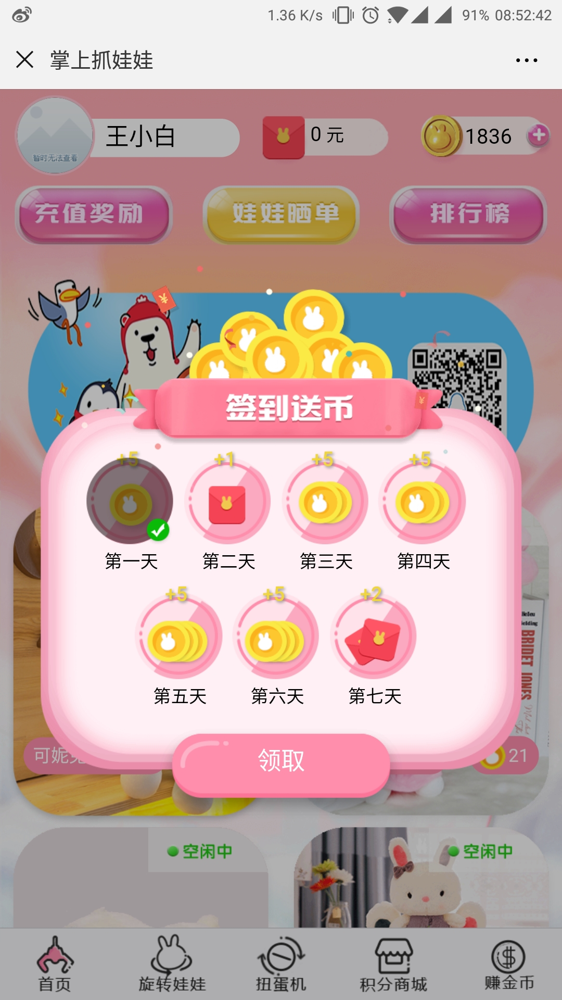
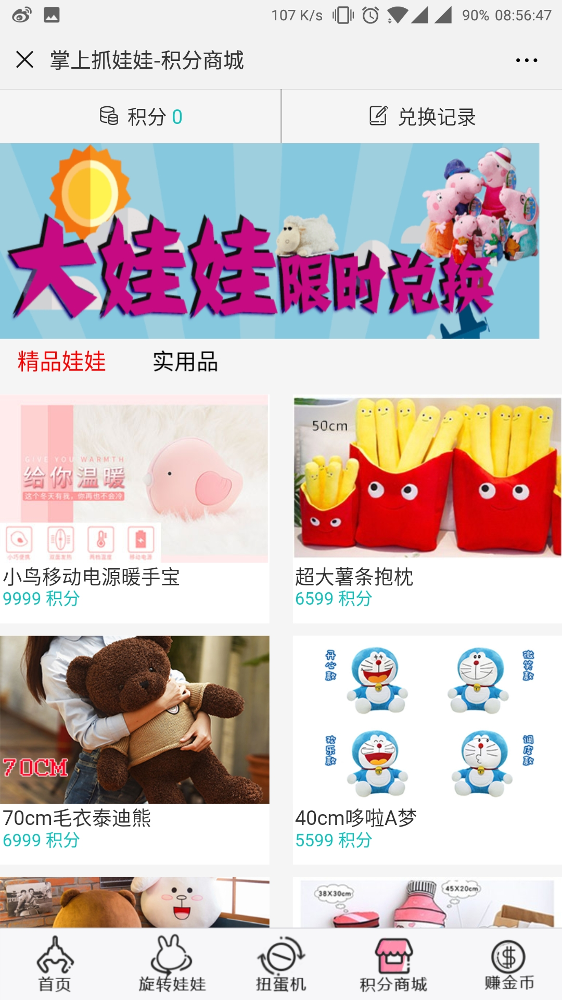
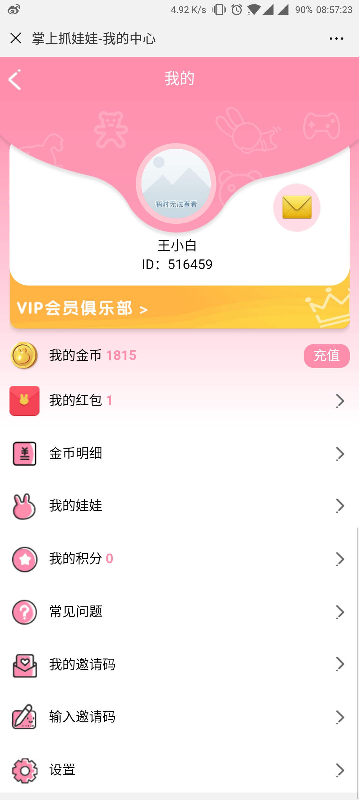

# **由于是公司的项目，并且使用的是微信登陆所以不能本地在线调试和登陆**
[暂时可查看的网址](https://wwj.whxyzx.cn/wawaji/h5/) 请使用微信打开此链接

> 使用的是
 * vue              --- 前端框架
 * vuex             --- 数据存储
 * axios            --- ajax请求库
 * localStorage     --- 本地存储
 * vux              --- UI库

- [x] 登陆
- [x] 首页
- [x] 旋转娃娃
- [x] 扭蛋机
- [x] 积分商城
- [x] 赚金币
- [x] 签到
- [x] 福利卡
- [x] 公告

# 安装依赖
1. node.js
2. `npm install` or `yarn install`
3. 运行项目
   `npm run dev` or `yarn run dev`
4. 打包项目
   `npm run build` or `yarn run build`

#### 后期准备 > mock假数据或练习后台制作数据
